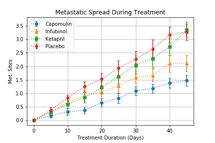

In this project, Matplotlib was used to visualize data from an animal study on the effectiveness of potential drug treatments on squamous cell carincoma (SCC), a 
commonly occuring form of skin cancer. 250 mice were treated in this study through a variety of drug regimes over the course of 45 days. Their physiological 
responses were then monitored over the course of that time. Matplotlib was used to analyze the data to show how four treatments (Capomulin, Infubinol, Ketapril, 
and Placebo) compare.

To investigate the data, the following four data visualizations were created:

* Scatter plot that shows how the tumor volume changes over time for each treatment
* Scatter plot that shows how the number of [metastatic](https://en.wikipedia.org/wiki/Metastasis) (cancer spreading) sites changes over time for each treatment
* Scatter plot that shows the number of mice still alive through the course of treatment (Survival Rate)
* Bar graph that compares the total % tumor volume change for each drug across the full 45 days


## Python Code

```python
# Dependencies and setup
%matplotlib inline
import matplotlib.pyplot as plt
import pandas as pd
import numpy as np

# Hide warning messages in notebook
import warnings
warnings.filterwarnings('ignore')

# File to load
mouse_drug_data_to_load = "data/mouse_drug_data.csv"
clinical_trial_data_to_load = "data/clinicaltrial_data.csv"

# Read the mouse and drug data and the clinical trial data
mouse_drug_data_df = pd.read_csv(mouse_drug_data_to_load)
clinical_trial_data_df = pd.read_csv(clinical_trial_data_to_load)

# Combine the data into a single dataset
data_merge_df = pd.merge(clinical_trial_data_df, mouse_drug_data_df, on="Mouse ID", how="left")

# Display the data table for preview
data_merge_df.head()
```


<div>
<table border="1" class="dataframe">
  <thead>
    <tr style="text-align: right;">
      <th></th>
      <th>Mouse ID</th>
      <th>Timepoint</th>
      <th>Tumor Volume (mm3)</th>
      <th>Metastatic Sites</th>
      <th>Drug</th>
    </tr>
  </thead>
  <tbody>
    <tr>
      <th>0</th>
      <td>b128</td>
      <td>0</td>
      <td>45.0</td>
      <td>0</td>
      <td>Capomulin</td>
    </tr>
    <tr>
      <th>1</th>
      <td>f932</td>
      <td>0</td>
      <td>45.0</td>
      <td>0</td>
      <td>Ketapril</td>
    </tr>
    <tr>
      <th>2</th>
      <td>g107</td>
      <td>0</td>
      <td>45.0</td>
      <td>0</td>
      <td>Ketapril</td>
    </tr>
    <tr>
      <th>3</th>
      <td>a457</td>
      <td>0</td>
      <td>45.0</td>
      <td>0</td>
      <td>Ketapril</td>
    </tr>
    <tr>
      <th>4</th>
      <td>c819</td>
      <td>0</td>
      <td>45.0</td>
      <td>0</td>
      <td>Ketapril</td>
    </tr>
  </tbody>
</table>
</div>


### Tumor Response to Treatment


```python
# Store the mean tumor volume data grouped by drug and timepoint, and convert groupby object into dataframe
tumor_volume_mean_group = data_merge_df.groupby(["Drug", "Timepoint"])["Tumor Volume (mm3)"].mean()
tumor_volume_mean_df = tumor_volume_mean_group.to_frame()

# Preview dataframe
tumor_volume_mean_df.head()
```


<div>
<table border="1" class="dataframe">
  <thead>
    <tr style="text-align: right;">
      <th></th>
      <th></th>
      <th>Tumor Volume (mm3)</th>
    </tr>
    <tr>
      <th>Drug</th>
      <th>Timepoint</th>
      <th></th>
    </tr>
  </thead>
  <tbody>
    <tr>
      <th rowspan="5" valign="top">Capomulin</th>
      <th>0</th>
      <td>45.000000</td>
    </tr>
    <tr>
      <th>5</th>
      <td>44.266086</td>
    </tr>
    <tr>
      <th>10</th>
      <td>43.084291</td>
    </tr>
    <tr>
      <th>15</th>
      <td>42.064317</td>
    </tr>
    <tr>
      <th>20</th>
      <td>40.716325</td>
    </tr>
  </tbody>
</table>
</div>


```python
# Store the standard error of tumor volumes grouped by drug and timepoint, and convert groupby object into dataframe
tumor_volume_sem_group = data_merge_df.groupby(["Drug", "Timepoint"])["Tumor Volume (mm3)"].sem()
tumor_volume_sem_df = tumor_volume_sem_group.to_frame()

# Preview dataframe
tumor_volume_sem_df.head()
```


<div>
<table border="1" class="dataframe">
  <thead>
    <tr style="text-align: right;">
      <th></th>
      <th></th>
      <th>Tumor Volume (mm3)</th>
    </tr>
    <tr>
      <th>Drug</th>
      <th>Timepoint</th>
      <th></th>
    </tr>
  </thead>
  <tbody>
    <tr>
      <th rowspan="5" valign="top">Capomulin</th>
      <th>0</th>
      <td>0.000000</td>
    </tr>
    <tr>
      <th>5</th>
      <td>0.448593</td>
    </tr>
    <tr>
      <th>10</th>
      <td>0.702684</td>
    </tr>
    <tr>
      <th>15</th>
      <td>0.838617</td>
    </tr>
    <tr>
      <th>20</th>
      <td>0.909731</td>
    </tr>
  </tbody>
</table>
</div>


```python
# Minor data munging to reformat the dataframes
tumor_volume_mean = tumor_volume_mean_df.unstack(level = 0)
tumor_volume_mean.columns = tumor_volume_mean.columns.get_level_values(1)

tumor_volume_sem = tumor_volume_sem_df.unstack(level = 0)
tumor_volume_sem.columns = tumor_volume_sem.columns.get_level_values(1)

# Preview that reformatting worked
tumor_volume_mean
```


<div>
<table border="1" class="dataframe">
  <thead>
    <tr style="text-align: right;">
      <th>Drug</th>
      <th>Capomulin</th>
      <th>Ceftamin</th>
      <th>Infubinol</th>
      <th>Ketapril</th>
      <th>Naftisol</th>
      <th>Placebo</th>
      <th>Propriva</th>
      <th>Ramicane</th>
      <th>Stelasyn</th>
      <th>Zoniferol</th>
    </tr>
    <tr>
      <th>Timepoint</th>
      <th></th>
      <th></th>
      <th></th>
      <th></th>
      <th></th>
      <th></th>
      <th></th>
      <th></th>
      <th></th>
      <th></th>
    </tr>
  </thead>
  <tbody>
    <tr>
      <th>0</th>
      <td>45.000000</td>
      <td>45.000000</td>
      <td>45.000000</td>
      <td>45.000000</td>
      <td>45.000000</td>
      <td>45.000000</td>
      <td>45.000000</td>
      <td>45.000000</td>
      <td>45.000000</td>
      <td>45.000000</td>
    </tr>
    <tr>
      <th>5</th>
      <td>44.266086</td>
      <td>46.503051</td>
      <td>47.062001</td>
      <td>47.389175</td>
      <td>46.796098</td>
      <td>47.125589</td>
      <td>47.248967</td>
      <td>43.944859</td>
      <td>47.527452</td>
      <td>46.851818</td>
    </tr>
    <tr>
      <th>10</th>
      <td>43.084291</td>
      <td>48.285125</td>
      <td>49.403909</td>
      <td>49.582269</td>
      <td>48.694210</td>
      <td>49.423329</td>
      <td>49.101541</td>
      <td>42.531957</td>
      <td>49.463844</td>
      <td>48.689881</td>
    </tr>
    <tr>
      <th>15</th>
      <td>42.064317</td>
      <td>50.094055</td>
      <td>51.296397</td>
      <td>52.399974</td>
      <td>50.933018</td>
      <td>51.359742</td>
      <td>51.067318</td>
      <td>41.495061</td>
      <td>51.529409</td>
      <td>50.779059</td>
    </tr>
    <tr>
      <th>20</th>
      <td>40.716325</td>
      <td>52.157049</td>
      <td>53.197691</td>
      <td>54.920935</td>
      <td>53.644087</td>
      <td>54.364417</td>
      <td>53.346737</td>
      <td>40.238325</td>
      <td>54.067395</td>
      <td>53.170334</td>
    </tr>
    <tr>
      <th>25</th>
      <td>39.939528</td>
      <td>54.287674</td>
      <td>55.715252</td>
      <td>57.678982</td>
      <td>56.731968</td>
      <td>57.482574</td>
      <td>55.504138</td>
      <td>38.974300</td>
      <td>56.166123</td>
      <td>55.432935</td>
    </tr>
    <tr>
      <th>30</th>
      <td>38.769339</td>
      <td>56.769517</td>
      <td>58.299397</td>
      <td>60.994507</td>
      <td>59.559509</td>
      <td>59.809063</td>
      <td>58.196374</td>
      <td>38.703137</td>
      <td>59.826738</td>
      <td>57.713531</td>
    </tr>
    <tr>
      <th>35</th>
      <td>37.816839</td>
      <td>58.827548</td>
      <td>60.742461</td>
      <td>63.371686</td>
      <td>62.685087</td>
      <td>62.420615</td>
      <td>60.350199</td>
      <td>37.451996</td>
      <td>62.440699</td>
      <td>60.089372</td>
    </tr>
    <tr>
      <th>40</th>
      <td>36.958001</td>
      <td>61.467895</td>
      <td>63.162824</td>
      <td>66.068580</td>
      <td>65.600754</td>
      <td>65.052675</td>
      <td>63.045537</td>
      <td>36.574081</td>
      <td>65.356386</td>
      <td>62.916692</td>
    </tr>
    <tr>
      <th>45</th>
      <td>36.236114</td>
      <td>64.132421</td>
      <td>65.755562</td>
      <td>70.662958</td>
      <td>69.265506</td>
      <td>68.084082</td>
      <td>66.258529</td>
      <td>34.955595</td>
      <td>68.438310</td>
      <td>65.960888</td>
    </tr>
  </tbody>
</table>
</div>


```python
# Generate the plot (with error bars)
fig, ax = plt.subplots()

# Title and axis labels
ax.set_title("Tumor Response to Treatment")
ax.set_xlabel("Time (Days)")
ax.set_ylabel("Tumor Volume (mm3)")

# X-axis
timepoint = tumor_volume_mean.index.tolist()
x_axis = np.arange(0, max(timepoint) + 5, 5)

# Samples list
samples = ["Capomulin", "Infubinol", "Ketapril", "Placebo"]

# Setup
ticks = np.arange(0, max(timepoint) + 5, 10)
ax.set_xticks(ticks)
ax.set_xlim(-2, max(timepoint) + 2)
ax.grid()

count = 0
markers = ['o', '^', 's', 'd']

for s in samples:
    ax.errorbar(x_axis, tumor_volume_mean[s], tumor_volume_sem[s], linestyle = ':', 
                 marker =  markers[count], capthick = 1, capsize = 3)
    count += 1

ax.legend()

# Save the figure
plt.savefig("analysis/Treatment_Effects_on_Tumor_Volume.png")

# Show the figure
plt.show()
```


### Metastatic Response to Treatment


```python
# Store the mean met. site data grouped by drug and timepoint, and convert groupby object into dataframe
tumor_metsite_mean_group = data_merge_df.groupby(["Drug", "Timepoint"])["Metastatic Sites"].mean()
tumor_metsite_mean_df = tumor_metsite_mean_group.to_frame()

# Preview dataframe
tumor_metsite_mean_df.head()
```


<div>
<table border="1" class="dataframe">
  <thead>
    <tr style="text-align: right;">
      <th></th>
      <th></th>
      <th>Metastatic Sites</th>
    </tr>
    <tr>
      <th>Drug</th>
      <th>Timepoint</th>
      <th></th>
    </tr>
  </thead>
  <tbody>
    <tr>
      <th rowspan="5" valign="top">Capomulin</th>
      <th>0</th>
      <td>0.000000</td>
    </tr>
    <tr>
      <th>5</th>
      <td>0.160000</td>
    </tr>
    <tr>
      <th>10</th>
      <td>0.320000</td>
    </tr>
    <tr>
      <th>15</th>
      <td>0.375000</td>
    </tr>
    <tr>
      <th>20</th>
      <td>0.652174</td>
    </tr>
  </tbody>
</table>
</div>


```python
# Store the standard error associated with met. site grouped by drug and timepoint, and convert groupby object into dataframe
tumor_metsite_sem_group = data_merge_df.groupby(["Drug", "Timepoint"])["Metastatic Sites"].sem()
tumor_metsite_sem_df = tumor_metsite_sem_group.to_frame()

# Preview dataframe
tumor_metsite_sem_df.head()
```


<div>
<table border="1" class="dataframe">
  <thead>
    <tr style="text-align: right;">
      <th></th>
      <th></th>
      <th>Metastatic Sites</th>
    </tr>
    <tr>
      <th>Drug</th>
      <th>Timepoint</th>
      <th></th>
    </tr>
  </thead>
  <tbody>
    <tr>
      <th rowspan="5" valign="top">Capomulin</th>
      <th>0</th>
      <td>0.000000</td>
    </tr>
    <tr>
      <th>5</th>
      <td>0.074833</td>
    </tr>
    <tr>
      <th>10</th>
      <td>0.125433</td>
    </tr>
    <tr>
      <th>15</th>
      <td>0.132048</td>
    </tr>
    <tr>
      <th>20</th>
      <td>0.161621</td>
    </tr>
  </tbody>
</table>
</div>


```python
# Minor data munging to reformat the dataframes
tumor_metsite_mean = tumor_metsite_mean_df.unstack(level = 0)
tumor_metsite_mean.columns = tumor_metsite_mean.columns.get_level_values(1)

tumor_metsite_sem = tumor_metsite_sem_df.unstack(level = 0)
tumor_metsite_sem.columns = tumor_metsite_sem.columns.get_level_values(1)

# Preview that reformatting worked
tumor_metsite_mean
```


<div>
<table border="1" class="dataframe">
  <thead>
    <tr style="text-align: right;">
      <th>Drug</th>
      <th>Capomulin</th>
      <th>Ceftamin</th>
      <th>Infubinol</th>
      <th>Ketapril</th>
      <th>Naftisol</th>
      <th>Placebo</th>
      <th>Propriva</th>
      <th>Ramicane</th>
      <th>Stelasyn</th>
      <th>Zoniferol</th>
    </tr>
    <tr>
      <th>Timepoint</th>
      <th></th>
      <th></th>
      <th></th>
      <th></th>
      <th></th>
      <th></th>
      <th></th>
      <th></th>
      <th></th>
      <th></th>
    </tr>
  </thead>
  <tbody>
    <tr>
      <th>0</th>
      <td>0.000000</td>
      <td>0.000000</td>
      <td>0.000000</td>
      <td>0.000000</td>
      <td>0.000000</td>
      <td>0.000000</td>
      <td>0.000000</td>
      <td>0.000000</td>
      <td>0.000000</td>
      <td>0.000000</td>
    </tr>
    <tr>
      <th>5</th>
      <td>0.160000</td>
      <td>0.380952</td>
      <td>0.280000</td>
      <td>0.304348</td>
      <td>0.260870</td>
      <td>0.375000</td>
      <td>0.320000</td>
      <td>0.120000</td>
      <td>0.240000</td>
      <td>0.166667</td>
    </tr>
    <tr>
      <th>10</th>
      <td>0.320000</td>
      <td>0.600000</td>
      <td>0.666667</td>
      <td>0.590909</td>
      <td>0.523810</td>
      <td>0.833333</td>
      <td>0.565217</td>
      <td>0.250000</td>
      <td>0.478261</td>
      <td>0.500000</td>
    </tr>
    <tr>
      <th>15</th>
      <td>0.375000</td>
      <td>0.789474</td>
      <td>0.904762</td>
      <td>0.842105</td>
      <td>0.857143</td>
      <td>1.250000</td>
      <td>0.764706</td>
      <td>0.333333</td>
      <td>0.782609</td>
      <td>0.809524</td>
    </tr>
    <tr>
      <th>20</th>
      <td>0.652174</td>
      <td>1.111111</td>
      <td>1.050000</td>
      <td>1.210526</td>
      <td>1.150000</td>
      <td>1.526316</td>
      <td>1.000000</td>
      <td>0.347826</td>
      <td>0.952381</td>
      <td>1.294118</td>
    </tr>
    <tr>
      <th>25</th>
      <td>0.818182</td>
      <td>1.500000</td>
      <td>1.277778</td>
      <td>1.631579</td>
      <td>1.500000</td>
      <td>1.941176</td>
      <td>1.357143</td>
      <td>0.652174</td>
      <td>1.157895</td>
      <td>1.687500</td>
    </tr>
    <tr>
      <th>30</th>
      <td>1.090909</td>
      <td>1.937500</td>
      <td>1.588235</td>
      <td>2.055556</td>
      <td>2.066667</td>
      <td>2.266667</td>
      <td>1.615385</td>
      <td>0.782609</td>
      <td>1.388889</td>
      <td>1.933333</td>
    </tr>
    <tr>
      <th>35</th>
      <td>1.181818</td>
      <td>2.071429</td>
      <td>1.666667</td>
      <td>2.294118</td>
      <td>2.266667</td>
      <td>2.642857</td>
      <td>2.300000</td>
      <td>0.952381</td>
      <td>1.562500</td>
      <td>2.285714</td>
    </tr>
    <tr>
      <th>40</th>
      <td>1.380952</td>
      <td>2.357143</td>
      <td>2.100000</td>
      <td>2.733333</td>
      <td>2.466667</td>
      <td>3.166667</td>
      <td>2.777778</td>
      <td>1.100000</td>
      <td>1.583333</td>
      <td>2.785714</td>
    </tr>
    <tr>
      <th>45</th>
      <td>1.476190</td>
      <td>2.692308</td>
      <td>2.111111</td>
      <td>3.363636</td>
      <td>2.538462</td>
      <td>3.272727</td>
      <td>2.571429</td>
      <td>1.250000</td>
      <td>1.727273</td>
      <td>3.071429</td>
    </tr>
  </tbody>
</table>
</div>


```python
# Generate the plot (with error bars)
fig, ax = plt.subplots()

ax.set_title("Metastatic Spread During Treatment")
ax.set_xlabel("Treatment Duration (Days)")
ax.set_ylabel("Met. Sites")

# X-axis
timepoint = tumor_metsite_mean.index.tolist()
x_axis = np.arange(0, max(timepoint) + 5, 5)

# Samples list: Capomulin, Infubinol, Ketapril, Placebo

# Setup
ticks = np.arange(0, max(timepoint) + 5, 10)
ax.set_xticks(ticks)
ax.set_xlim(-2, max(timepoint) + 2)
ax.grid()

count = 0
markers = ['o', '^', 's', 'd']

for s in samples:
    ax.errorbar(x_axis, tumor_metsite_mean[s], tumor_metsite_sem[s], linestyle = ':', 
                 marker =  markers[count], capthick = 1, capsize = 3)
    count += 1

ax.legend()

# Save the figure
plt.savefig("analysis/Treatment_Effects_on_Metastatic_Spread.png")

# Show the figure
plt.show()
```



### Survival Rates


```python
# Store the count of mice grouped by drug and timepoint, convert groupby object into dataframe, and reset index
tumor_mice_count_group = data_merge_df.groupby(["Drug", "Timepoint"])["Mouse ID"].count()
tumor_mice_count_df = tumor_mice_count_group.to_frame().reset_index()
tumor_mice_count_df = tumor_mice_count_df.rename(columns={"Mouse ID": "Mouse Count"})

# Preview dataframe
tumor_mice_count_df.head()
```


<div>
<table border="1" class="dataframe">
  <thead>
    <tr style="text-align: right;">
      <th></th>
      <th>Drug</th>
      <th>Timepoint</th>
      <th>Mouse Count</th>
    </tr>
  </thead>
  <tbody>
    <tr>
      <th>0</th>
      <td>Capomulin</td>
      <td>0</td>
      <td>25</td>
    </tr>
    <tr>
      <th>1</th>
      <td>Capomulin</td>
      <td>5</td>
      <td>25</td>
    </tr>
    <tr>
      <th>2</th>
      <td>Capomulin</td>
      <td>10</td>
      <td>25</td>
    </tr>
    <tr>
      <th>3</th>
      <td>Capomulin</td>
      <td>15</td>
      <td>24</td>
    </tr>
    <tr>
      <th>4</th>
      <td>Capomulin</td>
      <td>20</td>
      <td>23</td>
    </tr>
  </tbody>
</table>
</div>


```python
# Minor data munging to reformat the dataframes
tumor_mice_count = pd.DataFrame(tumor_mice_count_group)
tumor_mice_count = tumor_mice_count.unstack(level = 0)
tumor_mice_count.columns = tumor_mice_count.columns.get_level_values(1)

# Preview that reformatting worked
tumor_mice_count
```


<div>
<table border="1" class="dataframe">
  <thead>
    <tr style="text-align: right;">
      <th>Drug</th>
      <th>Capomulin</th>
      <th>Ceftamin</th>
      <th>Infubinol</th>
      <th>Ketapril</th>
      <th>Naftisol</th>
      <th>Placebo</th>
      <th>Propriva</th>
      <th>Ramicane</th>
      <th>Stelasyn</th>
      <th>Zoniferol</th>
    </tr>
    <tr>
      <th>Timepoint</th>
      <th></th>
      <th></th>
      <th></th>
      <th></th>
      <th></th>
      <th></th>
      <th></th>
      <th></th>
      <th></th>
      <th></th>
    </tr>
  </thead>
  <tbody>
    <tr>
      <th>0</th>
      <td>25</td>
      <td>25</td>
      <td>25</td>
      <td>25</td>
      <td>25</td>
      <td>25</td>
      <td>26</td>
      <td>25</td>
      <td>26</td>
      <td>25</td>
    </tr>
    <tr>
      <th>5</th>
      <td>25</td>
      <td>21</td>
      <td>25</td>
      <td>23</td>
      <td>23</td>
      <td>24</td>
      <td>25</td>
      <td>25</td>
      <td>25</td>
      <td>24</td>
    </tr>
    <tr>
      <th>10</th>
      <td>25</td>
      <td>20</td>
      <td>21</td>
      <td>22</td>
      <td>21</td>
      <td>24</td>
      <td>23</td>
      <td>24</td>
      <td>23</td>
      <td>22</td>
    </tr>
    <tr>
      <th>15</th>
      <td>24</td>
      <td>19</td>
      <td>21</td>
      <td>19</td>
      <td>21</td>
      <td>20</td>
      <td>17</td>
      <td>24</td>
      <td>23</td>
      <td>21</td>
    </tr>
    <tr>
      <th>20</th>
      <td>23</td>
      <td>18</td>
      <td>20</td>
      <td>19</td>
      <td>20</td>
      <td>19</td>
      <td>17</td>
      <td>23</td>
      <td>21</td>
      <td>17</td>
    </tr>
    <tr>
      <th>25</th>
      <td>22</td>
      <td>18</td>
      <td>18</td>
      <td>19</td>
      <td>18</td>
      <td>17</td>
      <td>14</td>
      <td>23</td>
      <td>19</td>
      <td>16</td>
    </tr>
    <tr>
      <th>30</th>
      <td>22</td>
      <td>16</td>
      <td>17</td>
      <td>18</td>
      <td>15</td>
      <td>15</td>
      <td>13</td>
      <td>23</td>
      <td>18</td>
      <td>15</td>
    </tr>
    <tr>
      <th>35</th>
      <td>22</td>
      <td>14</td>
      <td>12</td>
      <td>17</td>
      <td>15</td>
      <td>14</td>
      <td>10</td>
      <td>21</td>
      <td>16</td>
      <td>14</td>
    </tr>
    <tr>
      <th>40</th>
      <td>21</td>
      <td>14</td>
      <td>10</td>
      <td>15</td>
      <td>15</td>
      <td>12</td>
      <td>9</td>
      <td>20</td>
      <td>12</td>
      <td>14</td>
    </tr>
    <tr>
      <th>45</th>
      <td>21</td>
      <td>13</td>
      <td>9</td>
      <td>11</td>
      <td>13</td>
      <td>11</td>
      <td>7</td>
      <td>20</td>
      <td>11</td>
      <td>14</td>
    </tr>
  </tbody>
</table>
</div>


```python
# Generate the plot (accounting for percentages)

# Get percentages
tumor_mice_survival = tumor_mice_count * 100 / tumor_mice_count.iloc[0]

fig, ax = plt.subplots()

ax.set_title("Survival During Treatment")
ax.set_xlabel("Time (Days)")
ax.set_ylabel("Survival Rate (%)")

# X-axis
timepoint = tumor_mice_count.index.tolist()
x_axis = np.arange(0, max(timepoint) + 5, 5)

# Samples list: Capomulin, Infubinol, Ketapril, Placebo

# Setup
ticks = np.arange(0, max(timepoint) + 5, 10)
ax.set_xticks(ticks)
ax.set_xlim(-2, max(timepoint) + 2)
ax.grid()

count = 0
markers = ['o', '^', 's', 'd']

for s in samples:
    ax.plot(x_axis, tumor_mice_survival[s], linestyle = ':', 
                 marker =  markers[count])
    count += 1

ax.legend()

# Save the figure
plt.savefig("analysis/Treatment_Effects_on_Mice_Survival_Rate.png")

# Show the figure
plt.show()
```


### Summary Bar Graph


```python
# Calculate the percent changes for each drug
tumor_percent_change = (tumor_volume_mean.iloc[9] - tumor_volume_mean.iloc[0]) / tumor_volume_mean.iloc[0] * 100

# Display the data to confirm
tumor_percent_change
```


    Drug
    Capomulin   -19.475303
    Ceftamin     42.516492
    Infubinol    46.123472
    Ketapril     57.028795
    Naftisol     53.923347
    Placebo      51.297960
    Propriva     47.241175
    Ramicane    -22.320900
    Stelasyn     52.085134
    Zoniferol    46.579751
    dtype: float64


```python
# Store all relevant percent changes into a tuple
relevant_tumor_percent_change = [tumor_percent_change[s] for s in samples]
relevant_tumor_percent_change = tuple(relevant_tumor_percent_change)

# Splice the data between passing and failing drugs
failing_drugs = []
passing_drugs = []

for drug in relevant_tumor_percent_change:
    if drug < 0:
        passing_drugs.append(drug)

    else:
        failing_drugs.append(drug)

# Orient widths. Add labels, tick marks, etc. 
fig, ax = plt.subplots()

ax.set_title("Tumor Change Over 45 Day Treatment")
ax.set_ylabel("% Tumor Volume Change")

index = np.arange(len(relevant_tumor_percent_change))
index_end_passing = len(passing_drugs)
index_end_failing = len(failing_drugs) + 1

ax.set_xticks(index)
ax.set_xticklabels(samples)
ax.set_ylim([-30,70])
ax.grid(axis="y")

bar_passing_drugs = ax.bar(index[0:index_end_passing], passing_drugs, width=0.75, color="green")
bar_failing_drugs = ax.bar(index[index_end_passing: index_end_failing], failing_drugs, width=0.75, color="red")

# Use functions to label the percentages of changes
def label_failing_drugs(bars):
    for bar in bars:
        height = bar.get_height()
        ax.text(bar.get_x() + bar.get_width()/2, 3,
                f"{height:.0f}%",
                ha='center', va='bottom', color="white")

def label_passing_drugs(bars):
    for bar in bars:
        height = bar.get_height()
        ax.text(bar.get_x() + bar.get_width()/2, -8,
                f"{height:.0f}%",
                ha='center', va='bottom', color="white")

# Call functions to implement the function calls
label_passing_drugs(bar_passing_drugs)
label_failing_drugs(bar_failing_drugs)

# Save the figure
plt.savefig("analysis/Treatment_Effects_on_Percent_Tumor_Volume_Change.png")

# Show the figure
fig.show()
```


## Observations

* Capomulin was the only treatment to cause a significant reduction in tumor volume after 45 days (19% decrease, mean = 36.236 mm3, sem = 1.224) compared to the placebo (51% increase, mean = 68.084 mm3, sem = 1.352).  The other two treatments did not reduce tumor volume after 45 days (Infubinol: 46% increase, mean = 65.756 mm3, sem = 1.144; Ketapril: 57% increase, mean = 70.663 mm3, sem = 1.453).
* Capomulin significantly decreased metastatic spread after 45 days (mean = 1.476 metastatic sites, sem = 0.203) compared to the placebo (mean = 3.273 metastatic sites, sem = 0.304). Infubinol caused a smaller but significant reduction on metastatic spread (mean = 2.111 metastatic sites, sem = 0.309).  Ketapril did not have a significant effect on metastatic spread (mean = 3.364 metatstatic sites, sem = 0.279) comparaed to the placebo.
* Capomulin had the best effect on mouse survival rate (84% survival rate) in a 45 day period compared to the placebo (44% survival rate).  The other two treatments did not improve mouse survival rate (Infubinol: 36% survival rate, Ketapril: 44% survival rate) in a 45 day period more than the placebo.
